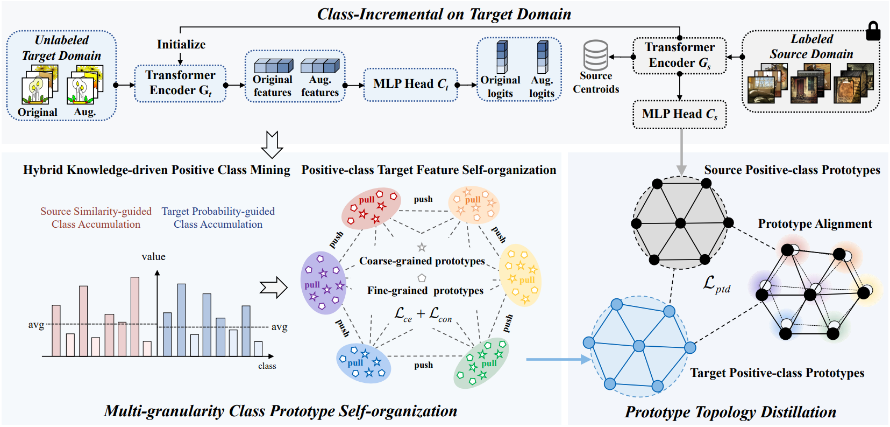

# Multi-Granularity Class Prototype Topology Distillation for Class-Incremental  Source-Free Unsupervised Domain Adaptation
[CVPR 2025] Official implementation of paper "Multi-Granularity Class Prototype Topology Distillation for Class-Incremental  Source-Free Unsupervised Domain Adaptation"
> This paper explores the Class-Incremental Source-Free Unsupervised Domain Adaptation~(CI-SFUDA) problem, where the unlabeled target data come incrementally without access to labeled source instances. This problem poses two challenges, the interference of similar source-class knowledge in target-class representation learning and the shocks of new target knowledge to old ones. To address them, we propose the Multi-Granularity Class Prototype Topology Distillation~(GROTO) algorithm, which effectively transfers the source knowledge to the class-incremental target domain. Concretely, we design the multi-granularity class prototype self-organization module and the prototype topology distillation module. First, we mine the positive classes by modeling accumulation distributions. Next, we introduce multi-granularity class prototypes to generate reliable pseudo-labels, and exploit them to promote the positive-class target feature self-organization. Second, the positive-class prototypes are leveraged to construct the topological structures of source and target feature spaces. Then, we perform the topology distillation to continually mitigate the shocks of new target knowledge to old ones. Extensive experiments demonstrate that our proposed method achieves state-of-the-art performance on three public datasets.



<div align="center">

[](https://arxiv.org/abs/2411.16064)

</div>


## 🔧 Installation
- Clone this repository:
```bash
git clone https://github.com/dengpeihua/GROTO.git
cd GROTO
```
- Install the environment by running the following command:
```bash
conda env create -f environment.yml
```

## 📊 Data Preparation
The files of data list and their corresponding labels have been put in the directory `./data_splits`, and the `imagenet_list.txt` can be downloaded at [GoogleDrive](https://drive.google.com/drive/folders/1MGFO41tVIsG1ckQmh0t3q9kJjmnXM2i2?usp=sharing).

Please manually download the office31, office-home and ImageNet-Caltech benchmarks from the [link](https://github.com/jindongwang/transferlearning/tree/master/data), [link](http://www.vision.caltech.edu/Image_Datasets/Caltech256) and [link](https://image-net.org/data/ILSVRC/2012/ILSVRC2012_img_train.tar), then put them into the corresponding directory (e.g., './dataset/office-home').

Put the corresponding file in your path (e.g., './dataset/office-home/Art.txt')

## ⚡ Source Pre-trained
To obtain the pre-trained model on the source domain:
- Pre-train on the amazon domain of Office-31-CI:
```bash
python source_train_office31.py --gpu 0 --source 0
```

- Pre-train on the Art domain of Office-Home-CI:
```bash
python source_train_office-home.py --gpu 0 --source 0
```

- from Caltech256 to ImageNet84:
```bash
python source_train_cal256.py --gpu 0
```

- from ImageNet1K to Caltech84:
```bash
python source_train_imagenet1k.py --gpu 0
```

## ➡️ Class-Incremental Source-Free Unsupervised Domain Adaptation
Run `.sh` scripts in the sh folder to obtain the results of different datasets.

## 💡 Checkpoints & Logs
We provide all source domain pre-trained models of three datasets, as well as the checkpoints and logs after class-incremental source-free unsupervised domain adaptation at [GoogleDrive](https://drive.google.com/drive/folders/1MGFO41tVIsG1ckQmh0t3q9kJjmnXM2i2).

## 🙏 Acknowledgments
We would like to thank the authors of previous related projects for generously sharing their code and insights: [ViT](https://github.com/lukemelas/PyTorch-Pretrained-ViT), [PCT](https://github.com/korawat-tanwisuth/Proto_DA) and [ProCA](https://github.com/Hongbin98/ProCA).

## 🤝 Citation
If you find our work useful, please consider giving a citation 📝 :)
```bibtex
@InProceedings{Deng_2025_CVPR,
    author    = {Deng, Peihua and Zhang, Jiehua and Sheng, Xichun and Yan, Chenggang and Sun, Yaoqi and Fu, Ying and Li, Liang},
    title     = {Multi-Granularity Class Prototype Topology Distillation for Class-Incremental Source-Free Unsupervised Domain Adaptation},
    booktitle = {Proceedings of the Computer Vision and Pattern Recognition Conference (CVPR)},
    month     = {June},
    year      = {2025},
    pages     = {30566-30576}
}
```
